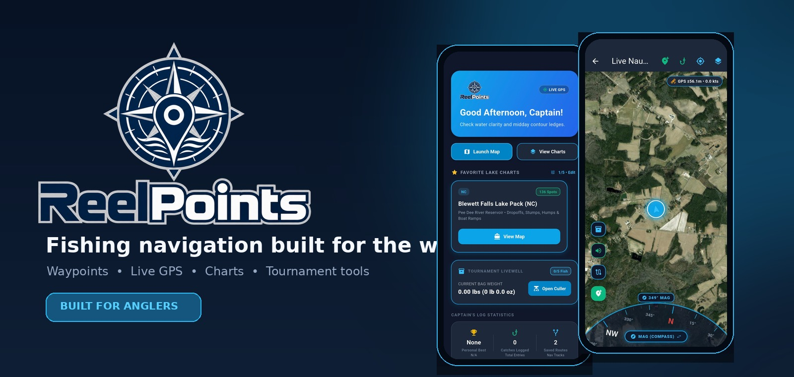
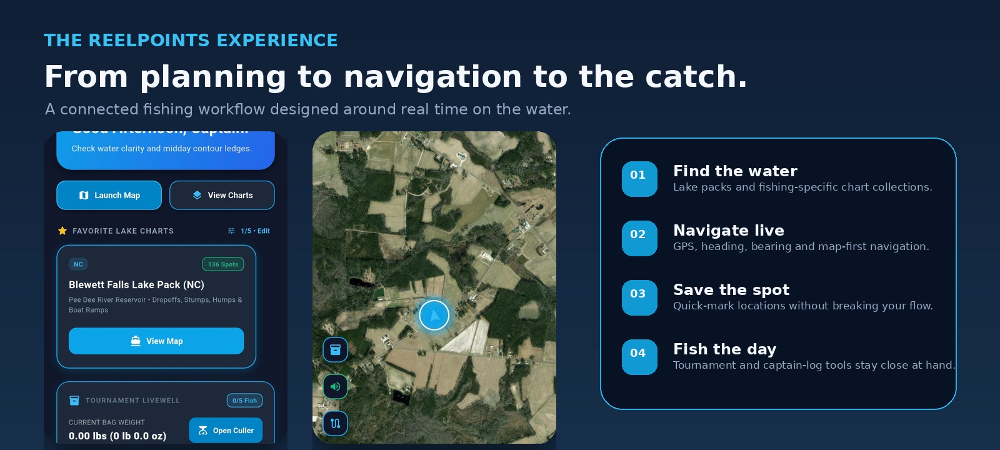
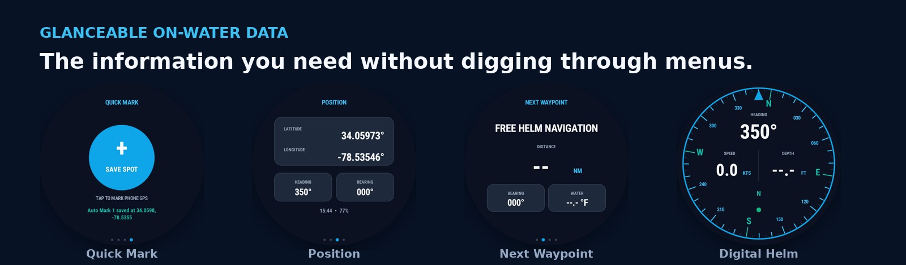
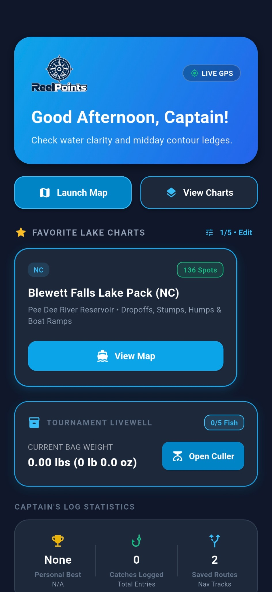
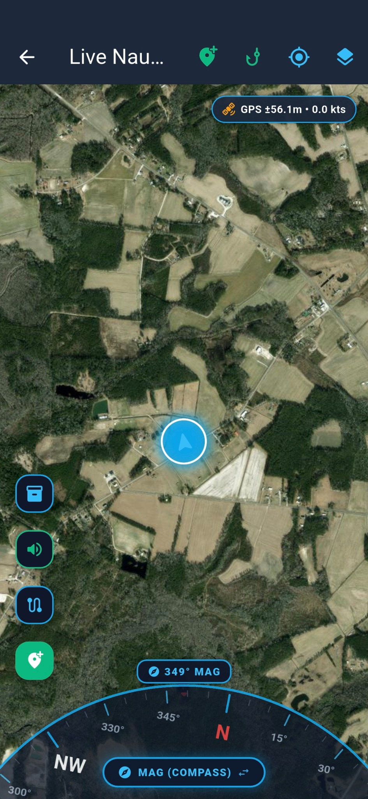
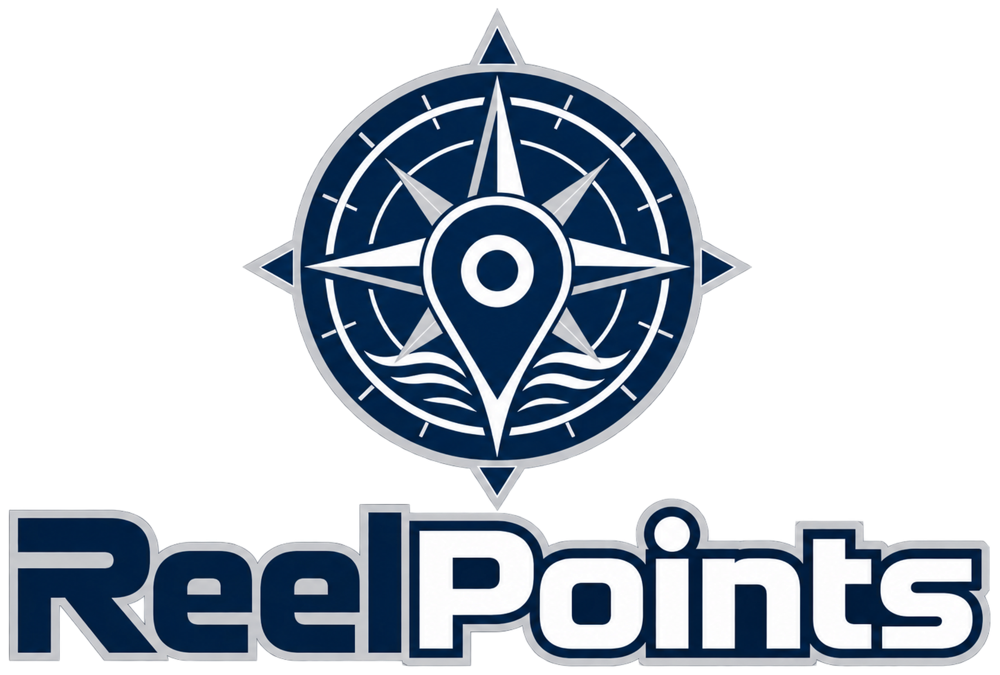

<div align="center">



<br />

# ReelPoints

### Navigation built around fishing.

**Precision waypoints · Live GPS · Lake & offshore chart packs · Tournament tools · Connected marine navigation**

<br />

[](#development)
[](#the-platform)
[](#the-platform)

</div>

---

## Fishing navigation should do more than show you a map.

Most navigation apps answer one question: **Where am I?**

ReelPoints is being built around the question anglers actually care about:

> **Where should I fish — and how do I get there?**

ReelPoints brings fishing-specific waypoints, live GPS navigation, chart packs, saved routes, tournament tools and on-water data into one purpose-built experience.



## The platform

<table>
<tr>
<td width="50%" valign="top">

### 📍 Fishing-specific waypoints

Build and use location libraries around the things anglers actually fish:

- Dropoffs
- Stumps
- Humps
- Ledges
- Structure
- Ramps and access points
- Saved fishing locations

</td>
<td width="50%" valign="top">

### 🗺️ Lake & offshore chart packs

Organize productive water into easy-to-use location packs instead of scattering years of fishing knowledge across devices and files.

ReelPoints is designed to support freshwater, coastal and offshore location libraries.

</td>
</tr>
<tr>
<td width="50%" valign="top">

### 🧭 Live navigation

The navigation experience puts the important information where it belongs:

- Live GPS
- Heading
- Bearing
- Speed
- Position
- Saved routes
- Quick-mark waypoint creation

</td>
<td width="50%" valign="top">

### 🎣 Built for the fishing day

ReelPoints goes beyond getting you to the spot.

The app UI includes tournament livewell tools, catch logging, favorite chart packs and a Captain's Log experience designed around what happens before, during and after a day on the water.

</td>
</tr>
</table>

---

## Built to be useful at a glance



Whether the next action is **marking a spot**, checking **latitude and longitude**, seeing the **next waypoint**, or reading the **digital helm**, ReelPoints keeps essential navigation data immediate.

---

## From road → ramp → water → fish

```text
TRIP PLANNING
      │
      ▼
LAKE / OFFSHORE PACK
      │
      ▼
LIVE NAVIGATION
      │
      ├──────────────► QUICK MARK
      │
      ├──────────────► SAVED ROUTES
      │
      ├──────────────► POSITION / BEARING
      │
      └──────────────► CAPTAIN'S LOG
                              │
                              ▼
                         FISHING DATA
```

The goal is a continuous fishing-navigation workflow instead of a collection of disconnected tools.

---

## Screens from the app

<table>
<tr>
<td width="50%" align="center">

<br />
<b>Dashboard & lake packs</b>
</td>
<td width="50%" align="center">

<br />
<b>Live navigation</b>
</td>
</tr>
</table>

---

## Marine connectivity

ReelPoints is being designed with a path toward a broader connected-vessel platform, including integration work around:

**Android Auto · NMEA 2000 · Bluetooth · Wi‑Fi marine sensors · vessel data**

That gives ReelPoints room to grow from a mobile navigation application into a system that can bring together fishing locations, route context and boat data.

---

## Why ReelPoints

| | |
|---|---|
| **Fishing first** | Features are designed around the workflow of an angler, not generic road navigation. |
| **Location libraries** | Fishing knowledge can be organized into lake, coastal and offshore packs. |
| **Fast access** | Important on-water information stays visible and easy to reach. |
| **Portable knowledge** | Fishing data should outlive any single GPS unit or chartplotter. |
| **Expandable platform** | ReelPoints is being built with vehicle and marine-system integration in mind. |

---

## Development

ReelPoints is under active development.

Current and planned areas include mobile navigation, waypoint management, lake and offshore packs, mapping, route tools, tournament features, Android Auto integration, marine sensor connectivity and fishing intelligence.

---

## Partnership & integration

We're interested in technology and data that make fishing navigation better, including:

**Marine electronics · Mapping · GPS · Sonar · NMEA 2000 · Weather & water data · Boat systems · Fishing data**

---

<div align="center">



### Know the spot. Get there. Fish it.

**ReelPoints — Built for the water.**

</div>
